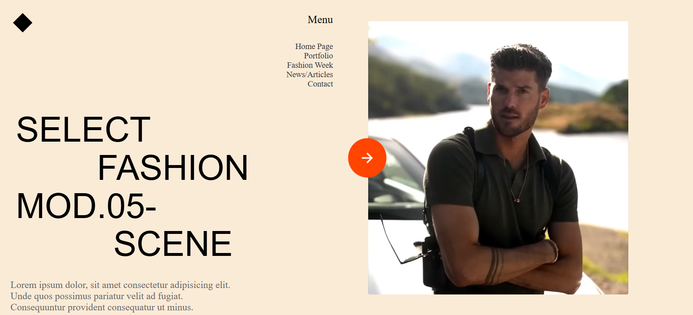
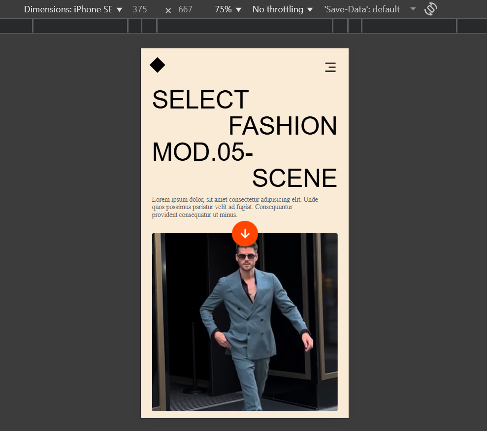

# 🎨 Fashion Portfolio Landing Page

A modern, responsive single-page fashion website built with pure HTML and CSS, featuring a dynamic grid layout and video integration.
Note: This project is created for educational purposes only to demonstrate web development skills.

## ✨ Features

- **CSS Grid Layout** - Clean, organized content structure
- **Fully Responsive** - Mobile-first design with media queries
- **Video Background** - Autoplay video integration
- **Modern Typography** - Bold, scalable text design
- **Mobile Navigation** - Hamburger menu for small screens

## 🛠 Tech Stack

- HTML5
- CSS3 (Grid, Flexbox, Media Queries)
- RemixIcon for icons
- Responsive design principles

## 📱 Responsive Design

- **Mobile**: Stacked layout with reorganized content flow
- **Breakpoint**: 600px for optimal mobile experience

## 📸 Screenshots

### Desktop View

### Mobile View  

> Add screenshots to showcase your responsive design skills

## 🚀 Quick Start

1. Clone the repository
2. Add your `video.mp4` file to the root directory
3. Open `index.html` in your browser

## 💡 Key Skills Demonstrated

- Semantic HTML structure
- Advanced CSS Grid implementation
- Responsive web design
- Cross-browser compatibility

---
